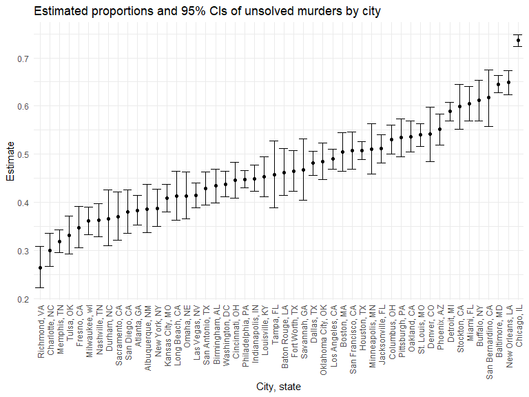

Homework 5 solutions
================
Zhengwei Song

## Problem 1

The code chunk below imports the data in individual spreadsheets
contained in `./data/zip_data/`. To do this, I create a dataframe that
includes the list of all files in that directory and the complete path
to each file. As a next step, I `map` over paths and import data using
the `read_csv` function. Finally, I `unnest` the result of `map`.

``` r
full_df = 
  tibble(
    files = list.files("data/zip_data/"),
    path = str_c("data/zip_data/", files)
  ) %>% 
  mutate(data = map(path, read_csv)) %>% 
  unnest()
```

The result of the previous code chunk isn’t tidy – data are wide rather
than long, and some important variables are included as parts of others.
The code chunk below tides the data using string manipulations on the
file, converting from wide to long, and selecting relevant variables.

``` r
tidy_df = 
  full_df %>% 
  mutate(
    files = str_replace(files, ".csv", ""),
    group = str_sub(files, 1, 3)) %>% 
  pivot_longer(
    week_1:week_8,
    names_to = "week",
    values_to = "outcome",
    names_prefix = "week_") %>% 
  mutate(week = as.numeric(week)) %>% 
  select(group, subj = files, week, outcome)
```

Finally, the code chunk below creates a plot showing individual data,
faceted by group.

``` r
tidy_df %>% 
  ggplot(aes(x = week, y = outcome, group = subj, color = group)) + 
  geom_point() + 
  geom_path() + 
  facet_grid(~group)
```


This plot suggests high within-subject correlation – subjects who start
above average end up above average, and those that start below average
end up below average. Subjects in the control group generally don’t
change over time, but those in the experiment group increase their
outcome in a roughly linear way.

## Problem 2

``` r
# Import the homicide dataset
homicide_raw = read_csv("./data/homicide-data.csv")
head(homicide_raw)
```

    ## # A tibble: 6 × 12
    ##   uid    repor…¹ victi…² victi…³ victi…⁴ victi…⁵ victi…⁶ city  state   lat   lon
    ##   <chr>    <dbl> <chr>   <chr>   <chr>   <chr>   <chr>   <chr> <chr> <dbl> <dbl>
    ## 1 Alb-0…  2.01e7 GARCIA  JUAN    Hispan… 78      Male    Albu… NM     35.1 -107.
    ## 2 Alb-0…  2.01e7 MONTOYA CAMERON Hispan… 17      Male    Albu… NM     35.1 -107.
    ## 3 Alb-0…  2.01e7 SATTER… VIVIANA White   15      Female  Albu… NM     35.1 -107.
    ## 4 Alb-0…  2.01e7 MENDIO… CARLOS  Hispan… 32      Male    Albu… NM     35.1 -107.
    ## 5 Alb-0…  2.01e7 MULA    VIVIAN  White   72      Female  Albu… NM     35.1 -107.
    ## 6 Alb-0…  2.01e7 BOOK    GERALD… White   91      Female  Albu… NM     35.2 -107.
    ## # … with 1 more variable: disposition <chr>, and abbreviated variable names
    ## #   ¹​reported_date, ²​victim_last, ³​victim_first, ⁴​victim_race, ⁵​victim_age,
    ## #   ⁶​victim_sex

-   Homicide data collected by the Washington Post for 50 major U.S.
    cities reported 52179 criminal homicides for a ten-year period,
    including 12 variables, such as uid, reported_date, victim_last,
    victim_first, victim_race, victim_age, victim_sex, city, state, lat,
    lon, disposition.

-   The `reported_date`, longitude `lon`, latitude `lat` were noted as
    numeric variables, while `age` is a character variable, and others
    as character variables.

-   Also, there are 60 missing values of latitude and 60 of longitude.
    Also, the city Tulsa, OK was incorrectly labeled in AL, and this
    observation will be dropped from subsequent data analysis.

-   In addition, some entries for victim race, age, and sex were
    reported as unknown.

``` r
# Clean dataset, create the variable city_state, and mutate the disposition data as solved or not
homicide_df = homicide_raw %>% 
    janitor::clean_names() %>%
    mutate(reported_date =
               as.Date(as.character(reported_date), format = "%Y%m%d"),
           city_state = str_c(city, state, sep = ", "),
           resolved = case_when(
      disposition == "Closed without arrest" ~ "unsolved",
      disposition == "Open/No arrest" ~ "unsolved",
      disposition == "Closed by arrest" ~ "solved",
    )) %>%
    relocate(city_state) %>%
    filter(city_state != "Tulsa, AL")
```

``` r
# summarize within cities to obtain the total number of homicides and the number of unsolved homicides
summary_hom_df = homicide_df %>% 
  group_by(city_state) %>% 
  summarize(
    hom_total = n(),
    hom_unsolved = sum(resolved == "unsolved")
  )
summary_hom_df %>% 
  knitr::kable(align = "lrr", 
               col.names = c("City", "Total number of homicides", "Number of unsovled homicides"))
```

| City               | Total number of homicides | Number of unsovled homicides |
|:-------------------|--------------------------:|-----------------------------:|
| Albuquerque, NM    |                       378 |                          146 |
| Atlanta, GA        |                       973 |                          373 |
| Baltimore, MD      |                      2827 |                         1825 |
| Baton Rouge, LA    |                       424 |                          196 |
| Birmingham, AL     |                       800 |                          347 |
| Boston, MA         |                       614 |                          310 |
| Buffalo, NY        |                       521 |                          319 |
| Charlotte, NC      |                       687 |                          206 |
| Chicago, IL        |                      5535 |                         4073 |
| Cincinnati, OH     |                       694 |                          309 |
| Columbus, OH       |                      1084 |                          575 |
| Dallas, TX         |                      1567 |                          754 |
| Denver, CO         |                       312 |                          169 |
| Detroit, MI        |                      2519 |                         1482 |
| Durham, NC         |                       276 |                          101 |
| Fort Worth, TX     |                       549 |                          255 |
| Fresno, CA         |                       487 |                          169 |
| Houston, TX        |                      2942 |                         1493 |
| Indianapolis, IN   |                      1322 |                          594 |
| Jacksonville, FL   |                      1168 |                          597 |
| Kansas City, MO    |                      1190 |                          486 |
| Las Vegas, NV      |                      1381 |                          572 |
| Long Beach, CA     |                       378 |                          156 |
| Los Angeles, CA    |                      2257 |                         1106 |
| Louisville, KY     |                       576 |                          261 |
| Memphis, TN        |                      1514 |                          483 |
| Miami, FL          |                       744 |                          450 |
| Milwaukee, wI      |                      1115 |                          403 |
| Minneapolis, MN    |                       366 |                          187 |
| Nashville, TN      |                       767 |                          278 |
| New Orleans, LA    |                      1434 |                          930 |
| New York, NY       |                       627 |                          243 |
| Oakland, CA        |                       947 |                          508 |
| Oklahoma City, OK  |                       672 |                          326 |
| Omaha, NE          |                       409 |                          169 |
| Philadelphia, PA   |                      3037 |                         1360 |
| Phoenix, AZ        |                       914 |                          504 |
| Pittsburgh, PA     |                       631 |                          337 |
| Richmond, VA       |                       429 |                          113 |
| Sacramento, CA     |                       376 |                          139 |
| San Antonio, TX    |                       833 |                          357 |
| San Bernardino, CA |                       275 |                          170 |
| San Diego, CA      |                       461 |                          175 |
| San Francisco, CA  |                       663 |                          336 |
| Savannah, GA       |                       246 |                          115 |
| St. Louis, MO      |                      1677 |                          905 |
| Stockton, CA       |                       444 |                          266 |
| Tampa, FL          |                       208 |                           95 |
| Tulsa, OK          |                       583 |                          193 |
| Washington, DC     |                      1345 |                          589 |

``` r
# estimate the proportion of homicides that are unsolved, save the output as an R object, pull the estimated proportion and confidence intervals
prop_baltimore = prop.test(
  summary_hom_df %>% filter(city_state == "Baltimore, MD") %>% pull(hom_unsolved), 
  summary_hom_df %>% filter(city_state == "Baltimore, MD") %>% pull(hom_total)) 
prop_baltimore %>% broom::tidy()
```

    ## # A tibble: 1 × 8
    ##   estimate statistic  p.value parameter conf.low conf.high method        alter…¹
    ##      <dbl>     <dbl>    <dbl>     <int>    <dbl>     <dbl> <chr>         <chr>  
    ## 1    0.646      239. 6.46e-54         1    0.628     0.663 1-sample pro… two.si…
    ## # … with abbreviated variable name ¹​alternative

``` r
# iterate to estimate the proportion of unsolved homicides in all cities
prop_cities = 
  summary_hom_df %>% 
  mutate(
    prop_tests = purrr::map2(.x = hom_unsolved, .y = hom_total, ~prop.test(x = .x, n = .y)),
    tidy_tests = purrr::map(.x = prop_tests, ~broom::tidy(.x))
  ) %>% 
  select(-prop_tests) %>% 
  unnest(tidy_tests) %>% 
  select(city_state, estimate, conf.low, conf.high)
```

``` r
# Create a plot showing the estimates and CIs for each city
prop_cities %>% 
  mutate(city_state = fct_reorder(city_state, estimate)) %>% 
  ggplot(aes(x = city_state, y = estimate)) +
  geom_point() + 
  geom_errorbar(aes(ymin = conf.low, ymax = conf.high)) + 
  theme(axis.text.x = element_text(angle = 90, vjust = 0.5, hjust = 1)) +
  labs(
    title = "Estimates and 95% CIs of Proportion of Unsolved Homicides in All Cities",
    x = "City",
    y = "Estimate")
```



 
